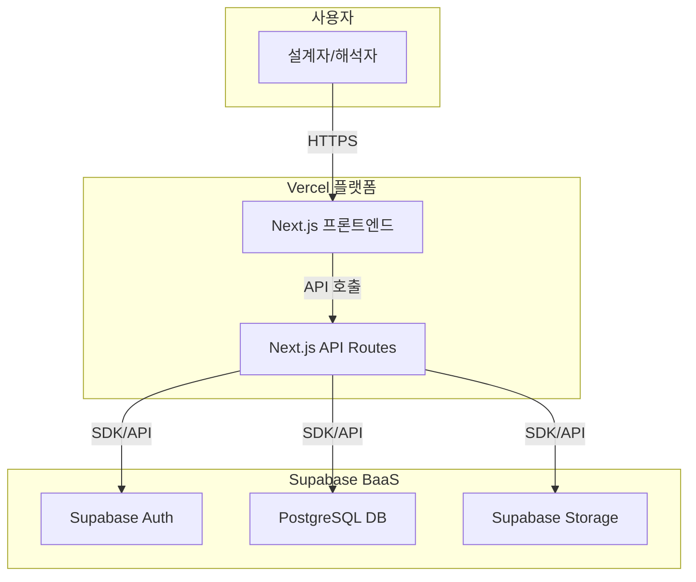

# 기술 요구사항 명세서 (TRD)

## 1. 기술 요약
- **프로젝트 개요**: 본 문서는 GOGOCAE_R1 프로젝트의 기술적 요구사항을 정의합니다. GOGOCAE_R1은 설계자와 해석자가 CAE(Computer-Aided Engineering) 해석 업무를 통합 관리하는 클라우드 기반 SaaS 웹 서비스입니다. 본 프로젝트의 기술 아키텍처는 빠른 MVP(Minimum Viable Product) 개발과 안정적인 확장을 목표로, 검증된 기술 스택을 활용하여 비즈니스 요구사항을 가장 직접적이고 효율적으로 충족시키는 데 중점을 둡니다.
- **핵심 기술 스택**: 프론트엔드와 백엔드 API는 Next.js(TypeScript)를 사용하여 통합 개발하고, 데이터베이스, 인증, 파일 스토리지는 Supabase BaaS(Backend as a Service)를 활용합니다. 전체 서비스는 Vercel 플랫폼을 통해 배포 및 운영됩니다. 이 조합은 개발 생산성을 극대화하고 초기 인프라 관리 비용을 최소화합니다.
- **주요 기술 목표**:
    - **성능**: 사용자가 캘린더/칸반 보드에서 업무 상태를 실시간에 가깝게 확인하고, 파일 업로드/다운로드를 원활하게 수행할 수 있는 응답 속도 확보.
    - **확장성**: 초기 동시 접속자 15명에서 향후 40명 이상으로 증가 시, Vercel의 서버리스 아키텍처와 Supabase의 확장성을 통해 안정적인 서비스 제공.
    - **신뢰성 및 유지보수성**: 역할 기반 접근 제어(RBAC)를 통한 데이터 보안을 보장하고, 도메인 주도 설계(DDD) 기반의 코드 구조를 통해 유지보수 용이성 확보.
- **핵심 기술 가정**:
    - Vercel과 Supabase의 프리 티어 또는 저비용 플랜으로 MVP 단계의 트래픽(동접 6~15명)을 충분히 감당할 수 있다고 가정합니다.
    - 사용자가 업로드하는 파일의 평균 크기와 총량이 Supabase Storage의 정책 및 비용 모델에 부합한다고 가정합니다.
    - 이메일 기반 인증만으로 MVP 단계의 사용자 인증 요구사항을 충족한다고 가정합니다.

## 2. 기술 스택
요구사항을 충족하는 가장 직접적이고 효율적인 기술 스택을 선정했습니다. 이는 과도한 엔지니어링을 피하고 MVP의 신속한 시장 출시를 지원하기 위함입니다.

| 분류 | 기술 / 라이브러리 | 선정 사유 |
| :--- | :--- | :--- |
| **프론트엔드** | Next.js (with TypeScript) | React 기반의 높은 생산성과 다양한 렌더링(SSR, SSG) 옵션을 제공하여 빠른 초기 로딩 속도와 우수한 사용자 경험을 보장합니다. TypeScript를 통해 코드 안정성과 유지보수성을 강화합니다. |
| **백엔드 API** | Node.js (Next.js API Routes) | 별도의 서버 구축 없이 Next.js 프레임워크 내에서 서버리스 함수 형태로 API를 간편하게 개발 및 배포할 수 있습니다. 이는 개발 복잡성을 줄이고 Vercel 배포에 최적화된 구조입니다. |
| **데이터베이스** | PostgreSQL (on Supabase) | 높은 안정성과 확장성을 지닌 오픈소스 RDBMS로, 복잡한 데이터 관계를 효과적으로 모델링할 수 있습니다. Supabase를 통해 손쉬운 관리와 자동 생성 API의 이점을 얻습니다. |
| **인증** | Supabase Auth | 이메일/비밀번호 기반 회원가입 및 로그인, 역할 기반 접근 제어(RBAC) 구현을 위한 포괄적인 기능을 제공하여 보안 인증 로직 개발 시간을 단축시킵니다. |
| **파일 스토리지** | Supabase Storage | 대용량 모델 및 보고서 파일의 안전한 업로드, 다운로드, 접근 제어 기능을 제공합니다. Vercel 및 Supabase DB와 긴밀하게 통합되어 개발이 용이합니다. |
| **배포/호스팅** | Vercel | Next.js 개발 및 배포에 최적화된 플랫폼으로, CI/CD 파이프라인 자동화, 글로벌 CDN, 서버리스 환경을 기본 제공하여 인프라 관리 부담 없이 빠른 배포와 안정적인 운영을 지원합니다. |

## 3. 시스템 아키텍처 설계

### 최상위 구성 요소
- **Next.js 웹 애플리케이션 (프론트엔드 & 백엔드)**: Vercel에서 실행되며, 사용자에게 UI를 제공하고 비즈니스 로직을 처리합니다.
    - **프론트엔드 (UI Layer)**: React 컴포넌트 기반의 사용자 인터페이스. 랜딩페이지, 대시보드, 칸반/캘린더 뷰 등을 포함합니다.
    - **백엔드 (API Routes)**: Next.js API Routes를 활용한 서버리스 API. 데이터베이스 CRUD, 파일 관리, 인증 처리 등 서버 측 로직을 수행합니다.
- **Supabase (BaaS 플랫폼)**: 백엔드 인프라의 핵심 기능을 제공하는 외부 서비스입니다.
    - **PostgreSQL 데이터베이스**: 애플리케이션의 모든 데이터(사용자, 해석 요청, 파일 메타데이터 등)를 저장합니다.
    - **Supabase Auth**: 사용자 인증 및 세션 관리를 전담합니다.
    - **Supabase Storage**: 사용자가 업로드하는 CAE 모델 및 결과 보고서 파일을 저장합니다.
- **Vercel (배포 및 호스팅 플랫폼)**: Next.js 애플리케이션의 빌드, 배포, 호스팅을 담당하는 클라우드 플랫폼입니다.

### 최상위 컴포넌트 상호작용 다이어그램


- **사용자 요청 처리**: 사용자는 브라우저를 통해 Vercel에 배포된 Next.js 프론트엔드와 상호작용합니다.
- **API 통신**: 프론트엔드에서 발생하는 데이터 요청(예: 해석 요청 목록 조회)은 Next.js API Routes로 전달됩니다.
- **백엔드 서비스 연동**: API Routes는 Supabase SDK를 사용하여 인증(Auth), 데이터베이스(PostgreSQL) 조회/수정, 파일 저장소(Storage) 접근 등 필요한 백엔드 작업을 처리합니다.
- **데이터 응답**: 처리 결과는 API Routes를 통해 프론트엔드로 다시 전달되어 사용자 화면에 렌더링됩니다.

### 코드 구성 및 규칙
**도메인 주도 구성 전략**
- **도메인 분리**: 코드를 비즈니스 도메인(예: `auth`, `requests`, `dashboard`) 단위로 구성하여 응집도를 높이고 결합도를 낮춥니다.
- **계층 기반 아키텍처**: 각 도메인 내부는 `components`(UI), `hooks`(상태 및 로직), `services`(API 통신), `types`(데이터 모델) 등 기능적 계층으로 분리하여 관심사를 명확히 구분합니다.
- **기능 기반 모듈**: 관련된 기능(예: 해석 요청 생성 폼, 요청 목록 테이블)을 하나의 모듈로 그룹화하여 재사용성과 유지보수성을 향상시킵니다.
- **공유 컴포넌트**: 여러 도메인에서 공통으로 사용되는 UI 컴포넌트, 유틸리티 함수, 타입 정의 등은 `shared` 또는 `common` 디렉토리에서 중앙 관리합니다.

**범용 파일 및 폴더 구조**
```
/
├── public/                  # 정적 에셋 (이미지, 폰트)
├── src/
│   ├── app/                 # Next.js App Router (페이지 및 레이아웃)
│   │   ├── (auth)/          # 인증 관련 페이지 (로그인, 회원가입)
│   │   ├── (main)/          # 메인 애플리케이션 페이지 (대시보드 등)
│   │   │   ├── dashboard/
│   │   │   └── layout.tsx
│   │   └── page.tsx         # 랜딩 페이지
│   ├── components/          # 공통 UI 컴포넌트 (Button, Input 등)
│   ├── domains/             # 비즈니스 도메인별 로직 및 컴포넌트
│   │   ├── auth/            # 인증 도메인
│   │   ├── request/         # 해석 요청 도메인
│   │   │   ├── components/
│   │   │   ├── services/
│   │   │   └── types.ts
│   │   └── dashboard/       # 대시보드 도메인
│   ├── lib/                 # 외부 라이브러리 설정 (Supabase 클라이언트 등)
│   ├── services/            # 전역 API 서비스 또는 유틸리티
│   └── styles/              # 전역 스타일
├── next.config.js
└── tsconfig.json
```

### 데이터 흐름 및 통신 패턴
- **클라이언트-서버 통신**: 클라이언트(브라우저)는 Next.js API Routes에 HTTP(S) 기반의 RESTful API 요청을 보냅니다. 데이터 교환 형식은 JSON을 사용합니다.
- **데이터베이스 상호작용**: 백엔드(API Routes)는 `supabase-js` SDK를 사용하여 타입-세이프(type-safe)한 방식으로 Supabase의 PostgreSQL 데이터베이스와 상호작용합니다.
- **외부 서비스 통합**: 모든 외부 서비스(Supabase Auth, Storage) 연동은 보안을 위해 서버 측(API Routes)에서 처리하는 것을 원칙으로 합니다.
- **파일 업로드/다운로드**:
    1.  클라이언트가 파일 업로드/다운로드를 요청합니다.
    2.  백엔드는 Supabase SDK를 사용해 해당 파일에 접근할 수 있는 시간제한이 있는 서명된 URL(signed URL)을 생성하여 클라이언트에 전달합니다.
    3.  클라이언트는 이 URL을 사용해 Supabase Storage에 직접 파일을 업로드하거나 다운로드합니다. 이 방식은 서버의 부하를 줄이고 보안을 강화합니다.

## 4. 성능 및 최적화 전략
- **프론트엔드 렌더링 최적화**: 정적인 랜딩페이지는 SSG(Static Site Generation)를, 동적인 대시보드 데이터는 SSR(Server-Side Rendering) 또는 CSR(Client-Side Rendering)을 조합하여 초기 로딩 속도와 데이터 최신성을 모두 확보합니다.
- **데이터베이스 쿼리 효율화**: 복잡한 조회 로직에는 데이터베이스 인덱스(index)를 적용하고, 필요한 데이터만 `SELECT`하여 네트워크 트래픽을 최소화합니다.
- **자산(Asset) 최적화**: Next.js의 `Image` 컴포넌트를 활용하여 이미지를 자동으로 최적화하고, 코드 분할(Code Splitting)을 통해 페이지별로 필요한 JavaScript만 로드하여 초기 로딩 성능을 향상시킵니다.
- **CDN 활용**: Vercel의 글로벌 Edge Network(CDN)를 통해 전 세계 사용자에게 정적 자산을 빠르게 제공하여 지연 시간을 최소화합니다.

## 5. 구현 로드맵 및 마일스톤
### 1단계: 기반 구축 (MVP 구현)
- **핵심 인프라**: Vercel 프로젝트 생성, Supabase 프로젝트 설정(DB 스키마, Auth, Storage 버킷).
- **필수 기능**:
    - 이메일 기반 회원가입/로그인 (Supabase Auth 연동)
    - 역할(설계자/해석자) 기반 접근 제어(RBAC) 기본 골격 구현
    - 해석 요청 생성/조회/수정 기능 (폼, API, DB 테이블)
    - 담당자 지정 및 업무 상태 변경 기능
    - 칸반 보드 및 캘린더 뷰 UI/UX 프로토타입 구현
    - 파일 업로드 및 다운로드 기능 (Supabase Storage 연동)
- **개발 환경 설정**: 개발 환경용 CI/CD 파이프라인 구축 (Vercel 연동).
- **예상 기간**: 3주 ~ 8주 (PRD 일정 기준)

### 2단계: 기능 고도화
- **고급 기능**: PRD 백로그 기능 구현 (우선순위 태그, 검색/필터, 댓글 기능).
- **성능 최적화**: MVP 운영 데이터 기반의 성능 병목 구간(느린 쿼리, 비효율적 렌더링) 분석 및 개선.
- **보안 강화**: 상세한 권한 정책 적용 및 보안 취약점 점검.
- **모니터링 구현**: Vercel Analytics, Supabase Logs 등을 활용한 사용자 행동 및 시스템 상태 모니터링 시스템 구축.
- **알림 기능**: 이메일 또는 Slack을 통한 주요 이벤트(신규 요청, 상태 변경) 알림 기능 구현.
- **예상 기간**: MVP 출시 후 2~4개월

## 6. 리스크 분석 및 완화 전략
### 기술 리스크 분석
- **기술 종속성 리스크**: Vercel 및 Supabase 플랫폼에 대한 높은 의존성.
    - **완화 전략**: 서비스 초기에는 플랫폼이 제공하는 생산성의 이점을 최대한 활용. 향후 서비스 규모가 커질 경우, 표준 기술(Next.js, PostgreSQL) 기반이므로 다른 클라우드(AWS, GCP)로의 마이그레이션 계획을 수립할 수 있음.
- **성능 리스크**: 데이터 및 파일 용량 증가 시 데이터베이스 쿼리 속도 저하 또는 스토리지 비용 급증.
    - **완화 전략**: 주기적인 데이터베이스 인덱싱 및 쿼리 최적화 수행. 파일에 대한 아카이빙 정책을 수립하고, Supabase의 비용 모델을 지속적으로 모니터링하여 예산을 관리.
- **보안 리스크**: 파일 및 데이터에 대한 부적절한 접근 또는 유출.
    - **완화 전략**: Supabase의 RLS(Row-Level Security) 정책과 역할 기반 접근 제어(RBAC)를 엄격하게 적용. 모든 통신은 HTTPS를 사용하고, 서명된 URL(signed URL)을 통해 파일 접근을 제어.

### 프로젝트 납품 리스크
- **일정 리스크**: MVP 개발 범위가 예상보다 커져 정해진 10주 내 출시가 지연될 가능성.
    - **완화 전략**: 2주 단위의 애자일 스프린트를 통해 진행 상황을 투명하게 공유하고, 기능의 우선순위를 지속적으로 재조정. MVP의 핵심 가치에 집중하고 부가 기능은 과감히 2단계로 이관.
- **리소스 리스크**: 특정 기술(예: Supabase RLS)에 대한 팀의 숙련도 부족으로 개발 지연.
    - **완화 전략**: 개발 초기에 공식 문서 학습 및 PoC(Proof of Concept)를 통해 핵심 기술을 검증. 필요시 외부 전문가 자문 또는 페어 프로그래밍을 통해 지식 격차 해소.
- **배포 리스크**: 프로덕션 환경에서 예상치 못한 설정 오류나 버그 발생.
    - **완화 전략**: 개발(Development), 스테이징(Staging), 프로덕션(Production) 환경을 분리하여 운영. Vercel의 Preview Deployments 기능을 활용하여 배포 전 충분한 테스트(UAT)를 수행.